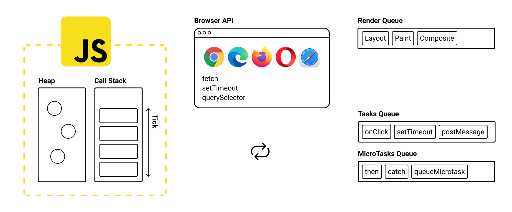

---

layout: yandex2

style: |
    /* собственные стили можно писать здесь!! */

    #question pre {
        margin: 0;
    }

    #async-errors pre {
        margin: 0;
    }

    #deb-and-thr img {
        width: 90%;
    }
---

# {:.logo}

## {{ site.presentation.title }}
{:.title}

### {{ site.presentation.service }}



{:.nda}


<div class="authors">


<p>{{ site.author.name }}, {{ site.author.position }}</p>



<p>{{ site.author2.name }}, {{ site.author2.position }}</p>


</div>

<!-- Начало презентации -->


## Несколько дел независимо
{:.fullscreen}

<figure markdown="1">
Несколько дел независимо
</figure>
{:style="width: 800px;"}

## Цикл событий в JavaScript
{:.images}



### [Event loop explainer](https://github.com/atotic/event-loop#event-loop-explainer)

## Прямо в Callback Hell...
{:.fullscreen}

<figure markdown="1">
Прямо в Callback Hell...
</figure>
{:style="width: 700px;"}

## Callback Hell и Pyramid of Doom

```js
fetchUser(url, (user) => {
    fetchRole(user, (role) => {
        fetchToken(role, (token) => {
            fetchAccess(token, (access) => {
                fetchReport(access, (report) => {
                    fetchContent(report, (content) => {
                        // вот теперь-то поработаем с данными
                    })
                })
            })
        })
    })
})
```
{:.next}

## В каком порядке выполнится код?

```js
A(() => {
    C()

    D(() => {
        F()
    })

    E()
})

B()
```
{:.next style="float:left;"}

- ...A → B → C → D → E → F
- ...A → C → D → F → E → B
- ...A → B → C → D → F → E
- ...A → C → D → E → B → F
{:.image-right style="margin-top: 30px"}

## Не выпускайте Залго!
{:.blockquote}

### [Don't release Zalgo!](https://oren.github.io/articles/zalgo/)<br>[Designing APIs for Asynchrony](https://blog.izs.me/2013/08/designing-apis-for-asynchrony)

## Жесткая сцепленность

...Усложняет обработку <b>ошибок</b>

```js
step1((error, data) => {
    if (error) {
        // отменить этап №1
    }
```
{:.next}
```js
    step2((error, data) => {
        if (error) {
            // отменить этап №2, а затем №1
        }
    })
}))
```
{:.next}

## Проблема доверия

```js
thirdPartyCode(callback)
```
{:.next}

...<b>Инверсия управления</b> — передать контроль над кодом кому-то еще

- ...Cлишком <b>рано</b> или слишком <b>поздно</b>
- ...Cлишком <b>мало</b> или слишком <b>много</b>
- ...Передать <b>неверные аргументы</b>
- ...<b>Поглотить</b> ошибки и исключения
- ...Вообще <b>пропустить вызов</b> callback


## Впереди появилась надежда
{:.fullscreen}

<figure markdown="1">
Впереди появилась надежда
</figure>
{:style="width: 850px;"}

## Обещание — это талон
{:.fullscreen}

<figure markdown="1">
Обещание — это талон
</figure>
{:style="width: 700px;"}

## Работа с обещаниями

- ...Создать обещание при помощи <b>new</b>
- ...Передать в конструктор функцию: <b>(resolve, reject) => { ... }</b>
- ...Внутри функции вызвать <b>resolve</b> и/или <b>reject</b>
- ...<b>resolve</b> и <b>reject</b> принимают <b>только один аргумент</b>
- ...Обработать выполнение и/или отказ через метод <b>then</b> или <b>catch</b>
- ...<b>then</b> обрабатывает выполнение и/или отказ, <b>catch</b> только отказ

## Обработка выполнения

```js
const promise = new Promise((resolve, reject) => {
    setTimeout(() => { resolve('👌') }, 1000)
})
```
{:.next}

```js
promise.then((value) => {
    console.log(value) // 👌
})
```
{:.next}


## Обработка отказа через then

```js
const promise = new Promise((resolve, reject) => {
    setTimeout(() => { reject('💥') }, 1000)
})
```
{:.next}

```js
promise.then(
    (value) => {
        // ... проигнорировано
    },
    (error) => {
        console.log(value) // 💥
    }
)
```
{:.next}

## Обработка отказа через catch

```js
const promise = new Promise((resolve, reject) => {
    setTimeout(() => { reject('💥') }, 1000)
})
```

```js
promise.catch((error) => {
    console.log(value) // 💥
})
```

## Либо выполнение, либо отказ

Promise устанавливается <b>либо на выполнение, либо на отказ</b>

```js
const promise = new Promise((resolve, reject) => {
    resolve('👌')
    reject('💥') // никак не повлияет на состояние Promise
})
```
{:.next}


## Один раз и навсегда

Promise устанавливается <b>единственный раз</b>

```js
const promise = new Promise((resolve, reject) => {
    resolve('👌')
    reject('💥') // никак не повлияет на состояние Promise
})
```

```js
promise.then((value) => {
    console.log(value) // 👌
})
promise.then((value) => {
    console.log(value) // 👌
})
```
{:.next}

## Цепочки Promise

...Обработчики неявно <b>возвращают новый Promise</b>

```js
promise
    .then(() => {
        // return new Promise((resolve) => resolve())
    })
    .then(() => {
        // мы ничего не вернули из then, но код продолжает работать
    })
```
{:.next}


## Возвращение значения через return

Любое значение, <b>кроме Promise</b> будет <b>завернуто в Promise</b>

```js
promise
    .then(() => {
        return 'Заверните меня, пожалуйста!'
    })
    .then((value) => {
        // у String нет метода then, но код продолжает работать
        console.log(value) // "Заверните меня, пожалуйста!"
    })
```
{:.next}

## Возвращение Promise через return

Promise вернется <b>без изменений</b>

```js
promise
    .then(() => {
        return new Promise((resolve) => resolve('🔥'))
    })
    .then((value) => {
        console.log(value) // 🔥
    })
```
{:.next}

## Каждый then цепляется к предыдущему

```js
promise
    .then((url) => {
        return fetchHost(url).then((address) => {
            return fetchConnection(address).then((connection) => {
                return fetchData(connection)
            })
        })
    })
    .then((data) => {
        // данные успешно загружены! 🎉
    })
```
{:.next}

## Порядок исполнения всегда линейный

```js
promise
    .then((url) => {
        return fetchHost(url)
    })
    .then((address) => {
        return fetchConnection(address)
    })
    .then((connection) => {
        return fetchData(connection)
    })
    .then((data) => {
        // данные успешно загружены! 🎉
    })
```


## Проброс отказа

```js
promise
    .then(() => {
        return new Promise((_, reject) => reject('💥'))
    })
    .then(() => {
        // все обработчики на выполнение будут пропущены
    })
    .catch((e) => {
        console.log(e) // 💥
    })
    .then(() => {
        // продолжаем цепочку в штатном режиме
    })
```
{:.next}

## Можно и через then

```js
promise
    .then(() => {
        return new Promise((_, reject) => reject('💥'))
    }, (e) => {
        // проигнорирует отказ, потому что в этом же then
    })
    .then(() => {
        // обработчик на выполнение снова будет пропущен
    }, (e) => {
        console.log(e) // 💥
    })
```

## Обработчик отказа поймает любые ошибки

```js
promise
    .then(() => {
        undefined.toString()
    })
    .catch((e) => {
        console.log(e) // TypeError: Cannot read property 'toString' of undefined
    })
```
{:.next}

## Спрятанный try/catch

```js
promise
    .then(() => {
        try {
            undefined.toString()
        } catch (e) {
            return new Promise((_, reject) => reject(e));
        }
    })
    .catch((e) => {
        console.log(e) // TypeError: Cannot read property 'toString' of undefined
    })
```

## Поставь catch в конце!
{:.blockquote}

## Кто поймает ошибку в последнем catch?

...Сборщик мусора! 🗑️

```js
window.addEventListener('unhandledrejection', (event) => {
    console.log('Необработанная ошибка Promise. Позор вам!')
    console.log(event) // PromiseRejectionEvent
    console.log(event.reason) // 💥
})

new Promise((_, reject) => reject('💥'))
```
{:.next}

### [В некоторых библиотеках есть метод .done](http://bluebirdjs.com/docs/api/done.html#done)
{:.next}

## finally

- ...Выполнит какую-то работу, <b>независимо</b> от <b>успеха</b> или <b>неудачи</b>
- ...<b>Ничего не получает</b>, но <b>пробрасывает</b> результат через себя

```js
Promise.resolve('👌').finally(() => {
    // какая-то работа
}).then((value) => {
    console.log(value) // 👌
})
```
{:.next style="float:left;"}

```js
Promise.reject('💥').finally(() => {
    // какая-то работа
}).catch((error) => {
    console.log(error) // 💥
})
```
{:.next.image-right}

### [Promise.prototype.finally](https://developer.mozilla.org/ru/docs/Web/JavaScript/Reference/Global_Objects/Promise/finally)


## Статические методы Promise
{:.section#static-methods}

### resolve, reject, all, race, allSelected, any

## Promise.resolve и Promise.reject

Обернут значение в <b>установленный Promise</b>

```js
const resolved = Promise.resolve('👌')
resolved.then((value) => {
    console.log(value) // 👌
})
```
{:.next}

```js
const rejected = Promise.reject('💥')
rejected.catch((value) => {
    console.log(value) // 💥
})
```
{:.next}

## Как Promise.resolve обработает Promise?

...<b>Promise.resolve</b> вернет его <b>без изменений</b>

```js
const promise = Promise.resolve('🍏');
```
{:.next}

```js
const resolved = Promise.resolve(promise)
```
{:.next}

```js
console.log(promise === resolved) // true
```
{:.next}

```js
resolved.then((value) => {
    console.log(value) // 🍏
})
```
{:.next}

## Как Promise.reject обработает Promise?

...<b>Promise.reject</b> как причину отказа еще раз его <b>обернет в Promise</b>

```js
const promise = Promise.resolve('🍏');
```
{:.next}

```js
const rejected = Promise.reject(promise)
```
{:.next}

```js
console.log(promise === rejected) // false
```
{:.next}

```js
rejected.catch((value) => {
    console.log(value) // Promise {<resolved>: 🍏}
})
```
{:.next}

## resolve и reject работают точно так же

```js
const promise = Promise.resolve('🍏');
```
{:.next}

```js
new Promise((resolve) => resolve(promise)).then((value) => {
    console.log(value) // 🍏
})
```
{:.next}

```js
new Promise((_, reject) => reject(promise)).catch((value) => {
    console.log(value) // Promise {<resolved>: 🍏}
})
```
{:.next}


## Thenable объект

...Объект, у которого <b>есть метод then</b>

```js
const thenable = {
    then () {
        return '🐵'
    }
}
```
{:.next}

...Скорее всего, это <b>полифилл для Promise</b> до ES6

## Всемогущая совместимость

- ...<b>Promise.resolve</b> и <b>resolve</b> распакуют значение <b>thenable объекта</b>
- ...Обернут распакованное значение в полноценный <b>ES6 Promise</b>

```js
const awesomeES6Promise = Promise.resolve(thenable)
```
{:.next}

```js
awesomeES6Promise.then((value) => {
    console.log(value) // 🐵
})
```
{:.next}

## Promise.all
- ...Принимает <b>массив</b> со <b>значениями</b> и/или <b>Promise</b>
- ...Возвращает <b>массив значений</b> или <b>первый отказ</b>

```js
Promise.all([
    Promise.resolve('🍍'),
    '🍉',
]).then((value) => {
    console.log(value) // [🍍, 🍉]
})
```
{:.next}

## Пример Promise.all

```js
Promise.all([
    fetchChats(),
    fetchPhotos(),
    fetchContacts(),
]).then(([chats, photos, contacts]) => {
    // получили параллельно все данные 👌
}).catch((error) => {
    // обработали первый отказ 💥
})
```

## Promise.race
- ...Принимает <b>массив</b> со <b>значениями</b> и/или <b>Promise</b>
- ...Возвращает <b>первое значение</b> или <b>первый отказ</b>

```js
Promise.race([
    Promise.resolve('🍍'),
    '🍉',
]).then((value) => {
    console.log(value) // 🍉
})
```
{:.next style="float:left;"}

```js
Promise.race([
    Promise.reject('💥'),
    '🍉',
]).catch((value) => {
    console.log(value) // 💥
})
```
{:.next.image-right}

## Пример Promise.race

```js
// запрос к самому быстрому дата-центру
Promise.race([
    fetchReplicaA(),
    fetchReplicaB(),
    fetchReplicaC(),
]).then((first) => {
    // получили ответ от самого быстрого дата-центра
}).catch((error) => {
    // обработали первый отказ 💥
})
```

## Крайние случаи

```js
// вернет пустой массивы
Promise.all([]).then((value) => {
    console.log(value) // []
})
```
{:.next}

```js
// зависнет навсегда в pending
Promise.race([]).then(
    () => { /* resolve не выполнится никогда */ },
    () => { /* reject тоже */ },
)
```
{:.next}

## Promise.allSettled

...Дождется <b>всех</b> и вернет <b>массив специальных объектов</b>

```js
Promise.allSettled([
    Promise.resolve('👌'),
    Promise.reject('💥'),
]).then(([resolved, rejected]) => {
    console.log(resolved) // { status: "fulfilled", value: 👌 }
    console.log(rejected) // { status: "rejected", reason: 💥 }
})
```
{:.next}

### [Promise.allSettled](https://developer.mozilla.org/ru/docs/Web/JavaScript/Reference/Global_Objects/Promise/allSettled)

## Promise.any

...Вернет <b>первое значение</b> или <b>массив с причинами отказа</b>

```js
Promise.any([
    fetchPrimaryDB(),
    fetchReplicaDB(),
]).then((first) => {
    // самый быстрый ответ
}).catch(([primaryError, replicaError]) => {
    // список ошибок
})
```
{:.next}

### [Promise.any](https://developer.mozilla.org/ru/docs/Web/JavaScript/Reference/Global_Objects/Promise/any)

## Пора выбраться из Callback Hell

```js
fetchToken(url, (token) => {
    fetchUser(token, (user) => {
        fetchRole(user, (role) => {
            fetchAccess(role, (access) => {
                fetchReport(access, (report) => {
                    fetchContent(report, (content) => {
                        // как же выбраться из Роковой Пирамиды?
                    })
                })
            })
        })
    })
})
```
{:.next}

## Всемогущий Promise
```js
fetchToken(url)
    .then(fetchUser)
    .then(fetchRole)
    .then(fetchAccess)
    .then(fetchReport)
    .then(fetchContent)
    .then((content) => {
        // Ура! У нас получилось!
    })
    .catch(errorHandler)
```
{:.next}

## Promise решает недостатки callback

- ...Асинхронный (прощай, Залго)
- ...Линейный (прощай, жесткая сцепленность)
- ...Одноразовый (проблема доверия решена)

## Как быть, когда Promise завис?

```js
Promise.race([
    fetchLongRequest(),
    new Promise((_, reject) => setTimeout(reject, 3000)),
]).then((data) => {
    // получили данные
}).catch((error) => {
    // или отказ по таймеру
})
```
{:.next}

## Асинхронность токсична
{:.fullscreen}

<figure markdown="1">
Асинхронность токсична
</figure>
{:style="width: 750px;"}

## async/await
{:.section#async-await}

### Синтаксис для работы с Promise

## Знакомьтесь, Async

...Асинхронная функция <b>заворачивает</b> свой результат в <b>Promise</b>

```js
async function asyncFunction () {
    return '🔥'
}

asyncFunction().then((value) => {
    console.log(value) // 🔥
})
```
{:.next style="float:left;"}

```js
function asyncFunction () {
    return Promise.resovle('🔥')
}
```
{:.next.image-right}

### [async/await](https://learn.javascript.ru/async-await)

## Знакомьтесь, Await

...Await <b>получает результат</b> из <b>Promise</b>
<br>и вызывается <b>только внутри</b> асинхронной функции

```js
(async () => {
    const value = await Promise.resolve('🔥')
    console.log(value) // 🔥
})()
```
{:.next}

## Привычные формы
{:.fullscreen}

<figure markdown="1">
Привычные формы
</figure>
{:style="width: 600px;"}

## Top level await

...Работает только для <b>ES модулей</b> или в <b>DevTools</b>

```js
const connection = await dbConnector();
```
{:.next}

```js
const jQuery = await import('http://cdn.com/jquery');
```
{:.next}

### [Top-level await in modules](https://exploringjs.com/impatient-js/ch_modules.html#top-level-await)

## Как работает top level await?

...Он делает модуль <b>асинхронным</b>

```js
// module.mjs
const value =
    await Promise.resolve('🔥')

export { value }
```
{:.next style="float:left;"}

```js
// main.mjs
import {
    value
} from './module.mjs'

console.log(value) // 🔥
```
{:.next.image-right}

## Как работает top level await?

```js
// module.mjs
export let value
export const promise = (async () => {
    value = await Promise.resolve('🔥')
})()

export { value, promise }
```
{:.next style="float:left;"}

```js
// main.mjs
import {
    value,
    promise
} from './module.mjs'

(async () => {
    await promise
    console.log(value) // 🔥
})()
```
{:.next.image-right}

## await — это просто оператор...

```js
console.log(await 42 + await Promise.resolve(42)) // 84
```
{:.next}

...однако скрытую опасность в себе он таит 😮

## Не все await одинаково полезны

```js
const articles = await fetchArticles()
const pictures = await fetchPictures()

// ... какие-то действия с articles и pictures
```
{:.next}

...Запросы <b>независимы</b>, но выполняются <b>последовательно</b>

### [Как избежать async/await ада](https://medium.com/@stasonmars/как-избежать-async-await-ада-dde39291bdb8)

## Делаем запросы параллельными

```js
// решение №1
const articlesPromise = fetchArticles()
const picturesPromise = fetchPictures()

const articles = await articlesPromise
const pictures = await picturesPromise
```
{:.next}

```js
// решение №2
const [articles, pictures] = await Promise.all([
    fetchArticles(),
    fetchPictures(),
])
```
{:.next}

## Обработка ошибок
{:#async-errors}

```js
// Вариант №1: try/catch
async function asyncFunction () {
    try {
        await Promise.reject('💥')
    } catch (e) {
        // перехватить ошибку
    }
}

asyncFunction().then((value) => {
    // мы в безопасности
})
```
{:.next style="float:left;"}

```js
// Вариант №2: catch
async function asyncFunction () {
    await Promise.reject('💥')
}

asyncFunction()
    .then((value) => {
        // вдруг ошибка?
    })
    .catch((error) => {
        // тогда её поймает catch
    })
```
{:.next.image-right}

## async функции и массивы
{:.section}

### forEach, map, filter, reduce

## forEach + async/await

```js
const wtf = ['🤯']

wtf.forEach(async (emoji) => {
    console.log(emoji)
})

console.log('It is asynchronous, baby')
```
{:.next}

```js
// 'It is asynchronous, baby'
// 🤯
```
{:.next}

## map + async/await

```js
const urls = ['/data', '/meta']

const result = urls.map(async (url) => {
    const response = await fetch(url)
    return await response.json()
})
```
{:.next}

```js
console.log(result) // [Promise, Promise]
```
{:.next}

## map + async/await, попытка №2

```js
const urls = ['/data', '/meta']

const promises = urls.map(async (url) => {
    return (await fetch(url)).json()
})
```

```js
const result = await Promise.all(promises)
console.log(result) // [{...}, {...}]
```
{:.next}

## filter + async/await

```js
const values = [null, 0, 42]

const wtf = values.filter(async (value) => {
    return Boolean(value)
})
```
{:.next}

```js
console.log(wtf) // [null, 0, 42]
```
{:.next}

## reduce + async/await

```js
const numbers = [4, 8, 15, 16, 23, 42]

const result = numbers.reduce(async (sum, number) => {
    return sum + number
}, 0)
```
{:.next}

```js
console.log(result) // Promise
```
{:.next}

```js
console.log(await result) // [object Promise]42
```
{:.next}

## reduce + async/await, попытка №2

```js
const numbers = [4, 8, 15, 16, 23, 42]

const result = numbers.reduce(async (sum, number) => {
    return (await sum) + number
}, 0)
```
{:.next}

```js
console.log(await result) // 108
```
{:.next}

## Callback, Promise или async/await?

- ...Обработчики событий работают только с функциями обратного вызова
- ...Во всех остальных случаях — async/await и обещания

## The End 👏
{:.section}

### Спасибо за внимание!


<!-- ## Контакты
{:.contacts}



<figure markdown="1">

### {{ site.author.name }}


{{ site.author.position }}


</figure>

 -->

<!-- 

<figure markdown="1">

### {{ site.author2.name }}


{{ site.author2.position }}


</figure>

 -->

<!-- разделитель контактов -->
<!-- ------- -->

<!-- left -->
<!-- - {:.skype}author -->
<!-- - {:.mail}author@yandex-team.ru -->
<!-- - {:.github}author -->

<!-- right -->
<!-- - {:.twitter}@author -->
<!-- - {:.facebook}author -->
<!-- - {:.telegram}@author -->

<!--

- {:.mail}author@yandex-team.ru
- {:.phone}+7-999-888-7766
- {:.github}author
- {:.bitbucket}author
- {:.twitter}@author
- {:.telegram}author
- {:.skype}author
- {:.instagram}author
- {:.facebook}author
- {:.vk}@author
- {:.ok}@author

-->
